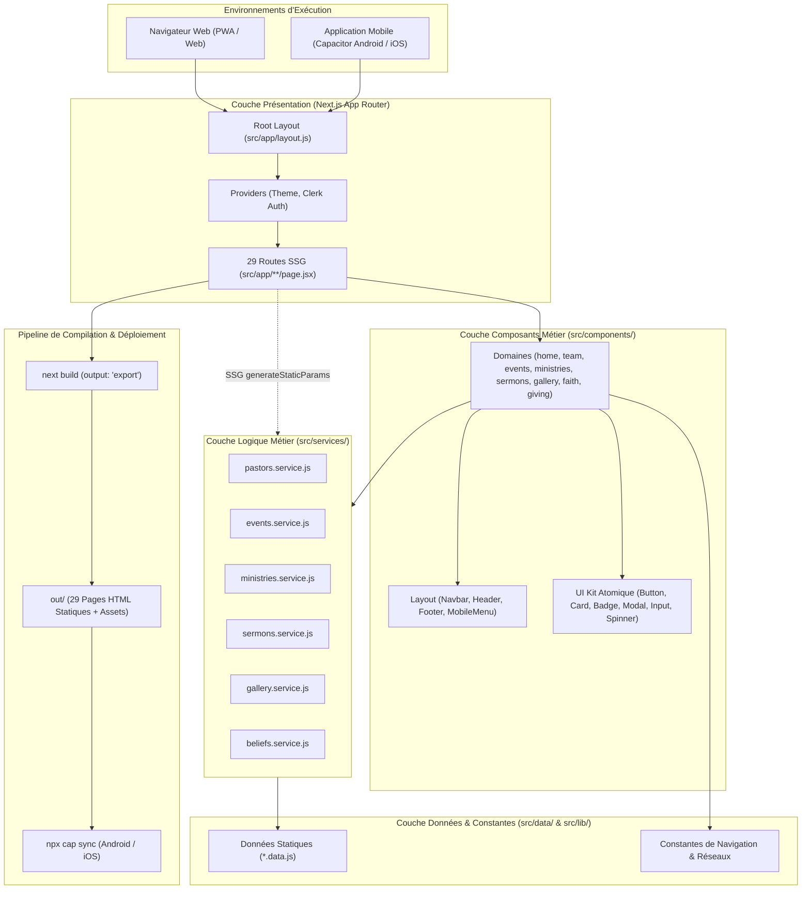
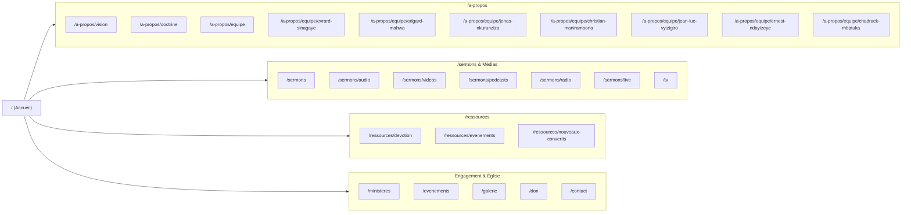

# Architecture & Organigramme — Projet Aletheia TRC

Ce document détaille l'architecture globale, l'organigramme des couches logicielles, la structure des routes Next.js App Router et le pipeline d'export mobile Capacitor pour l'application **Aletheia TRC**.

---

## 1. Vue d'Ensemble & Paradigme Architectural

Le projet suit une **architecture en couches découplées** (*Layered / Clean-Lite Architecture*), optimisée pour le **Static Site Generation (SSG)** de Next.js (`output: 'export'`) et le packaging mobile multiplateforme via **Capacitor**.

### Principes Clés
1. **Découplage Strict** : Les pages (`src/app/`) sont ultra-légères et délèguent l'affichage aux composants métier (`src/components/`), qui consomment les données via la couche de services (`src/services/`).
2. **Indépendance des Données** : Les données statiques (`src/data/`) sont isolées de l'UI. Si le projet migre plus tard vers une API REST, GraphQL ou Firebase, seuls les services changent, sans impacter les composants.
3. **Compatibilité Mobile Native (Capacitor)** : Aucun runtime serveur Node.js actif en production. Le build génère 100% de fichiers statiques (HTML, CSS, JS) dans le dossier `out/`.
4. **Système de Design Atomique** : Composants de base réutilisables dans `src/components/ui/` avec styles Tailwind CSS cohérents et mode sombre (Dark/Light).

---

## 2. Diagramme d'Architecture Globale (Flux & Couches)



---

## 3. Organigramme des Routes (Arborescence des 29 Pages SSG)

Toutes les routes sont pré-rendues statiquement lors de la compilation :



---

## 4. Arborescence Détaillée du Code Source (`src/`)

```
src/
├── app/                           # Couche Routage Next.js (App Router)
│   ├── layout.js                  # Layout racine (Providers, Header/Navbar, Footer)
│   ├── page.js                    # Page d'accueil (/)
│   ├── globals.css                # Styles globaux & Tailwind v4
│   ├── a-propos/
│   │   ├── vision/page.jsx        # /a-propos/vision
│   │   ├── doctrine/page.jsx      # /a-propos/doctrine
│   │   └── equipe/
│   │       ├── page.jsx           # /a-propos/equipe (Grille complète)
│   │       └── [id]/page.jsx      # /a-propos/equipe/[id] (SSG dynamique - 7 pasteurs)
│   ├── sermons/
│   │   ├── page.jsx               # /sermons (Catalogue global)
│   │   ├── audio/page.jsx         # /sermons/audio
│   │   ├── videos/page.jsx        # /sermons/videos
│   │   ├── podcasts/page.jsx      # /sermons/podcasts
│   │   ├── radio/page.jsx         # /sermons/radio (Lecteur streaming)
│   │   └── live/page.jsx          # /sermons/live
│   ├── ressources/
│   │   ├── devotion/page.jsx      # /ressources/devotion
│   │   ├── evenements/page.jsx    # /ressources/evenements
│   │   └── nouveaux-convertis/page.jsx # /ressources/nouveaux-convertis
│   ├── ministeres/page.jsx        # /ministeres
│   ├── evenements/page.jsx        # /evenements (Calendrier & filtres)
│   ├── galerie/page.jsx           # /galerie (Grille & Lightbox)
│   ├── don/page.jsx               # /don (Moyens de paiement & dîmes)
│   ├── contact/page.jsx           # /contact (Formulaire & coordonnées)
│   └── tv/page.jsx                # /tv (Stream vidéo Aletheia TV)
│
├── components/                    # Couche Composants Découplés
│   ├── ui/                        # Design System Atomique
│   │   ├── Button.jsx             # Bouton réutilisable (variantes, tailles)
│   │   ├── Card.jsx               # Carte container standardisée
│   │   ├── Badge.jsx              # Étiquettes de statut/catégorie
│   │   ├── Modal.jsx              # Fenêtre modale accessible
│   │   ├── Input.jsx              # Champ de texte stylisé
│   │   ├── Textarea.jsx           # Zone de texte stylisée
│   │   ├── SectionTitle.jsx       # En-tête standardisé de section
│   │   └── Spinner.jsx            # Indicateur de chargement
│   ├── layout/                    # Éléments structurants de page
│   │   ├── Header.jsx             # Top bar / Header
│   │   ├── Navbar.jsx             # Navigation principale responsive
│   │   ├── MobileMenu.jsx         # Menu tiroir mobile
│   │   ├── Footer.jsx             # Pied de page avec liens & contacts
│   │   ├── NavApropos.jsx         # Sous-menu déroulant À Propos
│   │   ├── NavSermon.jsx          # Sous-menu déroulant Sermons
│   │   ├── NavRessources.jsx      # Sous-menu déroulant Ressources
│   │   ├── ContactInfo.jsx        # Barre d'informations de contact rapide
│   │   └── PageContainer.jsx      # Conteneur responsive avec padding uniforme
│   ├── providers/                 # Fournisseurs de contexte React
│   │   ├── ThemeProvider.jsx      # Gestion thème Sombre / Clair (next-themes)
│   │   └── ClerkAppProvider.jsx   # Authentification Clerk (optionnelle)
│   ├── home/                      # Vues & sections de la page d'accueil
│   │   ├── HomeView.jsx           # Orchestrateur de la page d'accueil
│   │   ├── Hero.jsx & HeroContent.jsx # Bannière principale & carrousel
│   │   ├── Welcome.jsx            # Mot de bienvenue pastoral
│   │   ├── PortalCards.jsx        # Portails d'accès rapide
│   │   ├── Programs.jsx           # Horaires des cultes
│   │   ├── SermonFilter.jsx       # Sélecteur de sermons récents
│   │   └── DailyDevotion.jsx      # Encart dévotion du jour
│   ├── team/                      # Composants Équipe Pastorale
│   │   ├── TeamGrid.jsx           # Grille avec filtres par rôle
│   │   ├── TeamCard.jsx           # Carte individuelle d'un pasteur
│   │   └── TeamProfile.jsx        # Fiche détaillée d'un pasteur
│   ├── events/                    # Composants Événements
│   │   ├── EventCalendar.jsx      # Vue calendrier / liste
│   │   ├── EventCard.jsx          # Carte événement
│   │   └── EventFilters.jsx       # Filtres par catégorie / date
│   ├── ministries/                # Composants Ministères
│   │   ├── MinistryGrid.jsx       # Grille des départements
│   │   ├── MinistryCard.jsx       # Carte de département
│   │   └── MinistryModal.jsx      # Fiche modale d'un ministère
│   ├── sermons/                   # Composants Médias & Sermons
│   │   ├── AudioSermons.jsx       # Lecteur & liste audio
│   │   ├── VideoSermons.jsx       # Grille vidéo YouTube/Stream
│   │   ├── PodcastsSermons.jsx    # Liste des épisodes de podcasts
│   │   ├── RadioPlayer.jsx        # Lecteur Radio live
│   │   ├── TVPlayer.jsx           # Lecteur Aletheia TV live
│   │   └── LiveSermon.jsx         # Bannière de diffusion culte en direct
│   ├── gallery/                   # Composants Galerie Photo
│   │   ├── GalleryGrid.jsx        # Grille interactive d'images
│   │   ├── GalleryCard.jsx        # Carte image
│   │   ├── GalleryFilters.jsx     # Filtres par événement
│   │   └── Lightbox.jsx           # Visionneuse plein écran
│   ├── about/                     # Composants À Propos
│   │   ├── VisionSection.jsx      # Présentation vision & mission
│   │   └── BeliefsSection.jsx     # Déclaration de foi & doctrine
│   ├── faith/                     # Composants Vie Chrétienne
│   │   └── NewConvertsSection.jsx # Guide pour nouveaux convertis
│   ├── giving/                    # Composants Dons
│   │   └── GivingSection.jsx      # Guide des dons & options de virement
│   └── contact/                   # Composants Contact
│       └── ContactSection.jsx     # Formulaire & coordonnées
│
├── services/                      # Couche Métier / Abstraction des Données
│   ├── pastors.service.js         # getAll(), getById(), getSlugs()
│   ├── events.service.js          # getAll(), getUpcoming(), getById()
│   ├── ministries.service.js      # getAll(), getCategories(), getById()
│   ├── sermons.service.js         # getAll(), getByType(), getRecent()
│   ├── gallery.service.js         # getAll(), getCategories()
│   └── beliefs.service.js         # getBeliefs()
│
├── data/                          # Couche Données Brutes (Single Source of Truth)
│   ├── pastors.data.js            # Données biographiques & rôles de l'équipe
│   ├── events.data.js             # Événements passés et à venir
│   ├── departments.data.js        # Départements & ministères de l'église
│   ├── sermons.data.js            # Sermons audio, vidéo, podcasts
│   ├── gallery.data.js            # Galerie photos & albums
│   ├── beliefs.data.js            # Points doctrinaux & confessions de foi
│   ├── home.data.js               # Données de la page d'accueil
│   └── giving.data.js             # Informations bancaires & mobiles pour les dons
│
├── lib/                           # Utilitaires & Constantes partagées
│   └── constants/
│       ├── navigation.js          # Liens du menu, horaires des cultes
│       └── socials.js             # Liens des réseaux sociaux officiels
│
└── styles/
    └── globals.css                # Import Tailwind & directives CSS
```

---

## 5. Matrice des Responsabilités (Separation of Concerns)

| Couche | Répertoire | Rôle & Responsabilité | Dépend de |
| :--- | :--- | :--- | :--- |
| **Pages / Routing** | `src/app/` | Point d'entrée des URL, `generateStaticParams`, métadonnées SEO | `src/components/`, `src/services/` |
| **Composants Domaine** | `src/components/{domaine}/` | Logique d'affichage interactive, animations (Motion), mise en page | `src/components/ui/`, `src/services/`, `src/lib/` |
| **UI Kit** | `src/components/ui/` | Briques visuelles neutres, réutilisables (Button, Modal, Input...) | React, Tailwind CSS |
| **Services** | `src/services/` | Logique de filtrage, tris, recherche, règles métiers | `src/data/` |
| **Données** | `src/data/` | Objets JavaScript immutables (modèles, mock data, textes) | Aucune dépendance externe |
| **Constantes / Lib** | `src/lib/` | Configuration statique, URLs sociales, constantes de navigation | Aucune dépendance |

---

## 6. Flux de Données & Cycle de Vie

### 1. Exemple du Flux Équipe Pastorale :
1. `src/data/pastors.data.js` contient la liste des pasteurs avec leurs slugs (`"evrard-sinagaye"`, etc.).
2. `src/services/pastors.service.js` expose :
   - `pastorsService.getSlugs()` pour la génération statique.
   - `pastorsService.getById(id)` pour retrouver le pasteur demandé.
3. `src/app/a-propos/equipe/[id]/page.jsx` appelle `pastorsService.getSlugs()` dans `generateStaticParams()` pour précompiler les 7 pages HTML au build.
4. La page instancie `<TeamProfile pastor={pastor} />` qui utilise `<Card>`, `<Button>` et `<Badge>` de `src/components/ui/`.

### 2. Pipeline Mobile (Capacitor) :
```
[Code Source (src/)]
        │
        ▼ (npm run build)
[Next.js Static Export -> out/]
        │
        ▼ (npx cap sync)
[Capacitor Platforms]
 ├── android/app/src/main/assets/public/  -> Compilation APK / AAB
 └── ios/App/App/public/                  -> Compilation IPA Xcode
```
